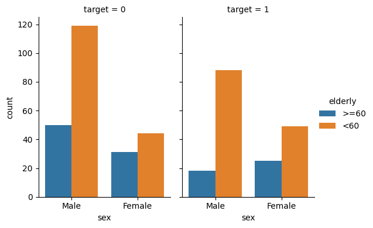
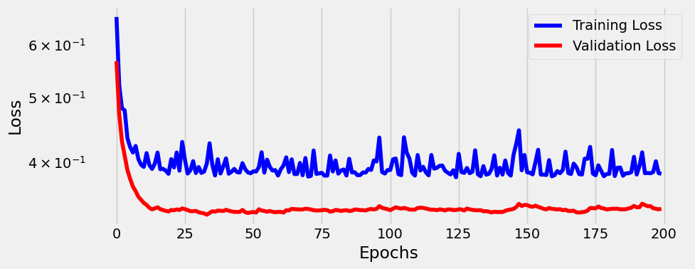

# ❤️ Heart Disease Prediction Project

This project focuses on predicting heart disease using machine learning models. It includes data cleaning, exploratory data analysis (EDA), feature importance analysis, model selection, parameter tuning, and deployment via a web service. The solution is designed for effective containerization and deployment.

---

## 🗂️ Table of Contents
1. [📌 Project Overview](#-project-overview)
2. [📁 Directory Structure](#-directory-structure)
3. [❓ Problem Description](#-problem-description)
4. [❓ Exploratory Data Analysis-EDA](eda-checkpoints])


---

## 📌 Project Overview

Heart disease remains one of the leading causes of death globally. This project uses machine learning techniques to predict the likelihood of heart disease based on patient data. 

Key features include:
- 🧹 Data preparation and cleaning.  
- 🔍 Exploratory Data Analysis (EDA) to uncover patterns and relationships.  
- 🧠 Model training, evaluation, and parameter optimization.  
- 🌐  
- ☁️  

---

## 📁 Directory Structure

```plaintext
Heart-Disease-App/
│
├── data/                          # Contains the dataset
├── data_preparation               # Scripts for creating pytorch tensors
├── model_configuration            # configure sequencial linear models
├── model_training                 # script for train model    
├── images                         # Contains images generates by model ouputs
└── README.md                      # Project description and instructions
```

---

## ❓ Problem Description

**Cardiovascular diseases** are a major global health challenge. This project aims to use machine learning to:
- ⚠️ Identify individuals at risk of heart disease.  
- 🩺 Assist healthcare professionals in making more informed decisions.  
- 🌍 Provide an easily deployable service for real-world applications.  

### Heart Disease Prediction Dataset 📊
This dataset was cloned from Maxim-eyengue github. He accquired the data from Kaggle community below.

[The dataset](https://www.kaggle.com/datasets/mfarhaannazirkhan/heart-dataset/data) combines five publicly available heart disease datasets, with a total of 2181  records:

<ul>
    <li> 📝 Heart Attack Analysis & Prediction Dataset: 304 records from Rahman, 2021</li>
    <li> 📝 Heart Disease Dataset: 1,026 records from Lapp, 2019</li>
    <li> 📝 Heart Attack Prediction (Dataset 3): 295 records from Damarla, 2020</li>
    <li> 📝 Heart Attack Prediction (Dataset 4): 271 records from Anand, 2018</li>
    <li> 📝 Heart CSV Dataset: 290 records from Nandal, 2022</li>
</ul>

Merging these data sets provides a more robust foundation for training machine learning models aimed at early detection and prevention of heart disease. 

The resulting dataset can be found in data subfolder and contains anonymized patient records with various features, such as age, cholesterol levels, and blood pressure, which are crucial for predicting heart attack and stroke risks, covering both medical and demographic factors.

---

### Features Description:
<ul>
    <li><strong>age</strong>: age of the patient 
        [years: Numeric]</li>
    <li><strong>sex</strong>: gender of the patient 
        [1: Male, 0: Female]</li>
    <li><strong>cp</strong>: chest pain type 
        [0: Typical Angina, 1: Atypical Angina, 2: Non-Anginal Pain, 3: Asymptomatic]</li>
    <li><strong>trestbps</strong>: resting blood pressure 
        [mm Hg: Numeric]</li>
    <li><strong>chol</strong>: serum cholesterol level 
        [mg/dl: Numeric]</li>
    <li><strong>fbs</strong>: fasting blood sugar 
        [1: if fasting blood sugar > 120 mg/dl, 0: otherwise]</li>
    <li><strong>restecg</strong>: resting electrocardiographic results 
        [0: Normal, 1: having ST-T wave abnormality (T wave inversions and/or ST elevation or depression of > 0.05 mV), 2: showing probable or definite left ventricular hypertrophy by Estes' criteria]</li>
    <li><strong>thalach</strong>: maximum heart rate achieved 
        [Numeric value between 60 and 202]</li>
    <li><strong>exang</strong>: exercise-induced angina 
        [1: Yes, 0: No]</li>
    <li><strong>oldpeak</strong>: ST depression induced by exercise relative to rest 
        [Numeric value measured in depression]</li>
    <li><strong>slope</strong>: slope of the peak exercise ST segment 
        [0: Upsloping, 1: Flat, 2: Downsloping]</li>
    <li><strong>ca</strong>: number (0-3) of major vessels (arteries, veins, and capillaries) colored by fluoroscopy 
        [0, 1, 2, 3] </li>
    <li><strong>thal</strong>: Thalassemia types 
        [1: Normal, 2: Fixed defect, 3: Reversible defect]</li>
    <li><strong>target</strong>: outcome variable for heart attack risk 
        [1: disease or more chance of heart attack, 0: normal or less chance of heart attack]</li>
</ul>


---

## Exploratory Data Analysis (EDA)
In this section i will explain how i got amazing insights using heart disease dataset.

First of all, it is important to read the csv file to the google colab enviroment in order to start the analysis. I uploaded the file directly from this Github to the Colaboratory using the code below:
```
try:
  df = pd.read_csv(url)
  print("Successfully read CSV from GitHub")
  # Now you can work with the DataFrame 'df'
  print(df.head()) # Example: Display the first few rows

except Exception as e:
  print(f"An error occurred: {e}")

```

## EDA Checkpoints
In order to make a good data analysis i have followed some checkpoints. They are described below:

**1. Descriptive Statistics:**
   - What is this highest values for each column?
   - What is the lowest values for each column?
   - According to the data dictionary, those numbers are correct?

**2. Mapping Categorical Columns:** Identify and name every categories from categorical column in order to make a understandable analysis later on

**3. Dealing with missing values:** Here we will identify how many rows are empty in our dataset and how deal with those observations.

**4. Removing duplicated rows:** Rows that are duplicated in a dataset do not include any information by the end of the day. It is important to remove them from our analysis

**5. Plotting Kernel Density Distribution from numerical features:** Here things starting to going well. It is time to see how the data is distributed and acquiring more insghits

**6. Plotting bar graph from categorical features:** On the other hand, categorical features can be analyzed ploting bar graphs

**7. Feature engineering:** is there any other feature combination in order to strenghten our insights? Let's see

## Descriptive Statistics:

From our first checkpoint we used the `pd.describe()` function so that we can compare the highest and loweste values from the dataframa to the dataset dictionary. Its output is pointed below:
```
        age	        sex	        cp	        trestbps	chol	    fbs	        restecg	    thalachh	exang	    oldpeak	    slope	    ca	        thal	    target
count	1888.000000	1888.000000	1888.000000	1888.000000	1888.000000	1888.000000	1888.000000	1888.000000	1888.000000	1888.000000	1888.000000	1888.000000	1888.000000	1888.000000
mean	54.354343	0.688559	1.279131	131.549258	246.855403	0.148305	0.597458	149.424258	0.331568	1.053761	1.421610	0.731462	2.662606	0.517479
std	    9.081505	0.463205	1.280877	17.556985	51.609329	0.355496	0.638820	23.006153	0.470901	1.161344	0.619588	1.015735	1.249924	0.499827
min	    29.000000	0.000000	0.000000	94.000000	126.000000	0.000000	0.000000	71.000000	0.000000	0.000000	0.000000	0.000000	0.000000	0.000000
25%	    47.750000	0.000000	0.000000	120.000000	211.000000	0.000000	0.000000	133.000000	0.000000	0.000000	1.000000	0.000000	2.000000	0.000000
50%	    55.000000	1.000000	1.000000	130.000000	241.000000	0.000000	1.000000	152.000000	0.000000	0.800000	1.000000	0.000000	2.000000	1.000000
75%	    61.000000	1.000000	2.000000	140.000000	276.000000	0.000000	1.000000	166.000000	1.000000	1.600000	2.000000	1.000000	3.000000	1.000000
max	    77.000000	1.000000	4.000000	200.000000	564.000000	1.000000	2.000000	202.000000	1.000000	6.200000	3.000000	4.000000	7.000000	1.000000

```

From the table, we could see that there are three columns with max. value which are not expected in the data dictionary. Those columns are:

`cp:` Chest pain type. Values: 0 = Typical angina, 1 = Atypical angina, 2 = Non-anginal pain, 3 = Asymptomatic. - **df Max Value = 04**

`slope:` Slope of the peak exercise ST segment. Values: 0 = Upsloping, 1 = Flat, 2 = Downsloping. . **DF max values = 03**

`ca:` Number of major vessels (0-3) colored by fluoroscopy. Values: 0, 1, 2, 3. **DF max. value = 04**

`thal:` Thalassemia types. Values: 1 = Normal, 2 = Fixed defect, 3 = Reversible defect. **DF Max. values = 07**

In order to correct it, we will use the function map() to set each number a category name. Leaving the actual data highest value out the mapping. Using this strategy will leave the dataframe with **NAN** observations 

## Map categorical Columns
Some categorical columns are expressed in terms of numbers. In order to better visualization, we will map categorical columns into new labels. Later on, we will create dummies variables.

```
df["sex"] = df["sex"].map({1: "Male", 0: "Female"})
df["cp"] = df["cp"].map({0: "Typical angina", 1: "Atypical angina", 2: "Non-anginal pain", 3: "Asymptomatic"})
df["restecg"] = df["restecg"].map({0: "Normal", 1: "ST-T wave abnormality", 2: "Left ventricular hypertrophy"})
df["exang"] = df["exang"].map({1: "Yes", 0: "No"})
df["slope"] = df["slope"].map({0: "Upsloping", 1: "Flat", 2: "Downsloping"})
df["thal"] = df["thal"].map({1: "Normal", 2: "Fixed defect", 3: "Reversible defect"})
df.head()

```

## Dealing with missing values (NAN)

Using the method `df.info()` we could se that from those 13 columns, most of all the filled without missing any value. Howevers, in the process of mapping categorical columns it had left some observations with NAN values.

As there were fews observations with missing values i have adopted the strategy of removing all observations with NAN. The process of removal was made using `df.dropna()` method.

After the removal, the dataset was left with 1702 non-null observations.

## Removing duplicated rows
During the process of Exploratory Data Analysis it is important to elimited duplicated observations throughout the dataset because those rows do not add any information in the classifications problem.

It has been removed **1464** duplicated rows (representing **77.54%** of the initial dataset)
The reduced dataset now has **424 rows**.

## Plotting Kernel Density Distribution from numerical features:
Next process in our checkpoint is to analyze Kernel Density Estimate (KDE for short). KDE plot means the probability distribution for each feature in our dataset.
It is important to bear in mind that KDE plot only makes sense for numerical values.


## Plotting bar graph from categorical features:
Similarly to numerical values in KDE plot, when analyzing categorical features we should use bar graph.
There are 7 subplots below, each one represeting a categorical column from our dataset.


## Feature Engineering

In this section i will describe how a combination of existing features can generate other ones. From my conception i always had in mind that heart disease is more likely to happen in elderly people (60 years old or older). Knowing this, it has been creating another categorical column meaning `ELDERLY`. This feature was created using the code below:

```
df_reduced['elderly'] = df_reduced['age'].apply(lambda x: '>=60' if x >= 60 else '<60')
```

Later i used `pd.crosstab()` method from pandas to analyze how data can be correlated when comparting sex (Male/Female) with elderly people (>=60 , <60 ) versus target column (likely or unlikely to have heart disease)

`pd.crosstab(df_reduced.target,[df_reduced.sex,df_reduced.elderly],margins=True)`

The output is shown below:

```
sex	Female	                Male	All
elderly	<60	>60	<60	>60	
target					
0	48	31	119	50	244
1	49	25	88	18	180
All	93	56	207	68	424
```

In the same way the crosstab can be plotted with clustered bar graph:



**Insights:** From the bargraph above surprisingly the dataset shows us the male people is more likely to have heart disease when they are younger than 60 years old!!

From women perspective, we can see that there are the same amount of individuals which had and had not a heart disease, comparing women younger thab 60 year old.

## Plot Correlation Matrix:
Correlation matrix is important to understand how other features are strong or weak linked with our target variable: likely or not likely to have a heart disease.
The closer correlation number to absolute 1, the stronger this feature is linked to our target. Meaning that when the feature grows, more likely to have heart disease.

Correlation Matrix is shown below:


**insights:** Despite only two features (`thalachh` and `oldpeaks`) have highest correlation with target columns (**0.26** and **-0.24** respectively) we will use all those numerical columns in our classification problem.

---

# Classification Heart Disease
In this section we will walk through all the way to the process of classification heart disesase with our model

Thi first lines of code is to import necessary libraries and classes that will be used in some moment of our project. For example, we have some class that will plot properly confusion matrix and metrics. Other important class is `Architecture()`. This class will be extremely import to receive a model and then train and validate it using Pytorch framework.

After this points we will pass for a series of checkpoint in order to get our dataset classified using Pytorch.

Those checkpoints are:

1.  Data Preparation:
        * Create dummy variables
        * Creator tensors
        * build train and validation dataset/dataloader

2. Configure Model: determine some parameters:
      * Which model should we use to classify binary output?
      * Defines Stocastic Gradient Descent
      * Defines a loss function to classification

3. Train the model itself using `Architeture()` class

4. Validate the Model:
      * is the model accurate to our problem?
      * Let's evaluate some metrics such as:
        - Recall/Precision
        - Accuracy
        - True and False Positive Rates

5. Make Predictions

## 1. Data Preparation
Most of work has been done during the EDA parts. However, something must be adapted in order to our classify works properly

First we need to convert categorical features into dummy ones using the code below:
```
# Create dummy variables for categorical features
categorical_cols = ['sex','cp', 'restecg', 'exang', 'slope','thal','elderly']
df_dummy = pd.get_dummies(df, columns=categorical_cols, drop_first=True)
print(df_dummy.shape)
```

Next, it is necessary to create tensor and send to the GPU device.

```
# Define features (X) and target (y)
X = df_dummy.drop('target', axis=1).values
y = df_dummy['target'].values

# Split data into training and validation sets while maintaining target proportion
X_train, X_val, y_train, y_val = train_test_split(X, y, test_size=0.2, random_state=42, stratify=df_dummy['target'])

# Scale features using StandardScaler
scaler = StandardScaler()
X_train = scaler.fit_transform(X_train)
X_val = scaler.transform(X_val)

# Convert data to PyTorch tensors
X_train_tensor = torch.tensor(X_train, dtype=torch.float32)
y_train_tensor = torch.tensor(y_train, dtype=torch.float32).reshape(-1, 1)  # Reshape for single output
X_val_tensor = torch.tensor(X_val, dtype=torch.float32)
y_val_tensor = torch.tensor(y_val, dtype=torch.float32).reshape(-1, 1)

# Create TensorDatasets
train_dataset = TensorDataset(X_train_tensor, y_train_tensor)
val_dataset = TensorDataset(X_val_tensor, y_val_tensor)

# Create DataLoaders in mini_batch type with 16 observations
train_loader = DataLoader(train_dataset, batch_size=16, shuffle=True)
val_loader = DataLoader(val_dataset, batch_size=16, shuffle=False)
```

One of the biggest mistakes in classification problem is to let train and validation dataset with disproportional values of our target column.

because of that we will calculate the proportion of target in the main dataset and will leave with same ratio in train and validation division.

The whole dataset is composed by the ratio below:
	    
target | proportion
------ | ------------
0	  |  0.575472
1	  |  0.424528

Whereas the proportion of true values in the target train and validation are:

 y_train= 0.42

 y_val = 0.42

 The proportion of true values in train and validation dataset is the same of the original dataframe

 ## 2) Configure Model

 In this section we will configure our classification model.

Starting with the following hyper-parameters:

* lr = 0.05
* model: linear with 19 predictors (dataset features exluding target column)
* Optimizer: Stochastic Gradient Descent
* Loss Function: Binary-Cross Entropy with Logit Loss. This loss function is widely used in classification problems because its output means logit that can be used for determining a probability of an event to happen

## 3) Training/Validation

The code below represents the calling for training and validating our model using `Architecture()` class. It receives as parameters the model itself, the loss function configured before and Optimizer.

The number of epochs was set to 200 loops.

```
#set number of epochs
n_epochs = 200

#using Architecture class passing model, loss and optimized as parameters
arch = Architecture(model, loss_fn, optimizer)
arch.set_loaders(train_loader, val_loader)
arch.set_seed(42)
arch.train(n_epochs)
```

The next figure represents the model output for train anda validating loss function.



From the figure above we can see the lines of training and validation loss.

It is ease to see that our model did not overfitted because the error of train/validation remained similar throughout the epochs. However, the validation error itself can be optimized.

## 4) Metrics
In this part we will analyze how good were the predictions of our model.

First of all let's plot the confusion matrix and see the 4 quadrants represents by True Negative (TN), False Positive (FP), False Negative (FN), True Positive (TP):


Some important metrics when analyzing classifications problems are True and False Positive Rates (TPR/FPR); Precision and Recall; and Accuracy. Each metrics is represented by its formula below:

True and False Positive Ratio
----------------------------
$$
\Large \text{TPR} = \frac{\text{TP}}{\text{TP + FN}} \ \ \  \text{FPR} = \frac{\text{FP}}{\text{FP + TN}}
$$

Precion and Recall
----------------------------
$$
\Large \text{Recall} = \frac{\text{TP}}{\text{TP + FN}} \ \ \  \text{Precision} = \frac{\text{TP}}{\text{TP + FP}}
$$

Accuracy
----------------------------
$$
\Large \text{Accuracy} = \frac{\text{TP+TN}}{\text{TP+TN+FP+FN}}
$$

We can use `accuracy_score()` method directly from Sklearn

Our model metrics are displayed below:


---

# Model 1 Conclusion

The first model was configurated using these parameters below:

  * lr = 0.05
  * train/val split ratio = 0.2
  * number of epochs = 200
  * Optimizer: SGD 

With this configuration we got the results from the confusion matrix and bar graph above:

  1. Precision Metrics: 0.75

  1. Recall Metrics: 0.833

  1. Accuracy score 0.812

  1. True Positive Rate:0.833

  1. False Positive Rate:0.204

More over, knowing that Heart disease identification is a sensible matter we have to bear in mind the **False Negative** number which means that an individual has a heart problem and our model did not identified properly, leaving the person in serious risk!

For model 1 and using a threshold limiter of 0.5 we got False Negative Number of 6 misclassication. 

It seems low, right? but even lower the better. Can we decrease even more this number?

From mode 1 we have used the whole heart desease dataset. However, during our EDA phase it has been identified that some feature can iteract more with our target column than the other. Let's filter our dataset with this "best features"

---

# Model 2
From now on we will be using the "selected" dataset. Here will be using numerical features with correlation greater than 0.2 with compared to target column. Besides we will be still using all categorical features as presented before.
 
The features of this dataset are:

**categorical_cols**

 - sex
 - cp
 - restecg
 - exang
 - slope
 - thal
 - elderly

**Numerical** 
 - Oldpeak
 - Thalachh

The same process of model 1 preparation was done to the second as well. It means we took our csv file containing selected features, create dummies for categorical variables, and splot the data into train/validation set with ratio of 0.2 (same as before).

In order to compare with model 1 we have used the same hyper-parameters:

* lr = 0.05
* train/val split ratio = 0.2
* number of epochs = 200
* Optimizer: SGD

## Training/Validating model 2

The figure below represents the train/validation process of model 2 which looks very similar to the first model


## Metrics for model 2
In the same way, we have plot Confusion Matrix portrayed below:


Model 2 and its configuration got us some metrics:


We can see that using the same configuration of model 1 but using selected feature we had a little bit increase in all metrics except in False Positive Ratio.

Here is a summary of the changes:

- `Precision` : 1,59% increase. Reaching 0.7619
- `Recall` : 6,67% increase. Reaching 0.8889
- `Accuracy` : 2,90% increase. Reaching 0.8353
- `True Positive Ratio` : 6,67%. Reaching 0.8889
- `False Positive Ratio` did not have any change


Moreover, when analyzing the False Negative Number it decrease from **6** people in first model to **4** in model 2. It is a satisfatory model!

However we can decrease even more this number if we see the confusion matrix from model 2.

What if we reduce the threshold value from 0.5 to 0.4?

---

# Comparing models with threshold of 0.4

First let's plot confusion matrix of model 1 and its metrics:


An then let's analyze model 2 metrics with threshold of 0.4:


---

# Project Conclusion
After comparing models with 0.4 threshold we could see that both behave similarly. In other word, both models give the same metrics.

Both models gives us the following output during the validation set:

- `Precision` :  0.7727
- `Recall` :  0.9444
- `Accuracy` :  0.8588
- `True Positive Ratio` : 0.9444
- `False Positive Ratio`: 0.2041
- `False negative number`: 2 individuals


However the second model tends to be better because it has less features when compared to the first one. Hence we will choose the **model 2 to put in production**


   


